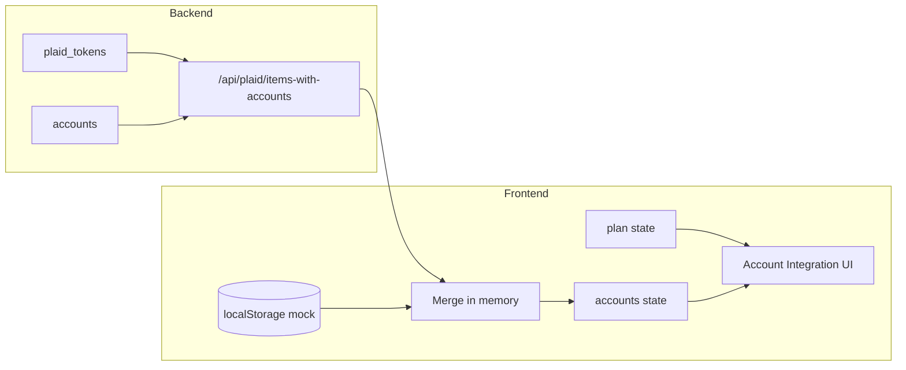
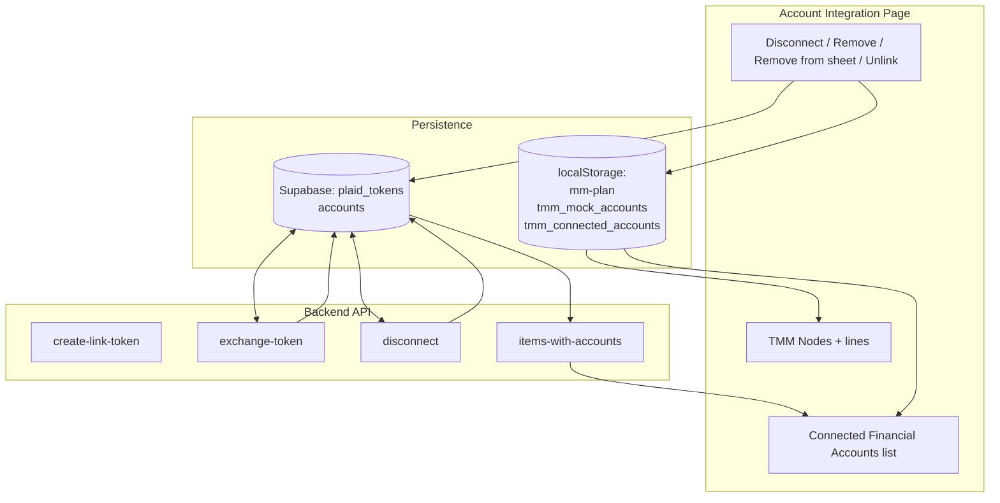

# Account Integration — Where Data Lives and How It Flows

This document explains where CFA (Connected Financial Accounts) and link data are stored, how the Account Integration page loads and updates them, and how the design stays robust.

---

## 1. Where CFA data is stored

```
┌─────────────────────────────────────────────────────────────────────────────────┐
│                           ACCOUNT INTEGRATION DATA                                │
├─────────────────────────────────────────────────────────────────────────────────┤
│                                                                                  │
│  PLAID (real bank connections)                                                  │
│  ─────────────────────────────                                                  │
│                                                                                  │
│    Supabase (backend, server-only)                                               │
│    ┌──────────────────────────────────────┐  ┌──────────────────────────────┐  │
│    │ plaid_tokens                          │  │ accounts                      │  │
│    │ • item_id (Plaid Item)                │  │ • user_id                     │  │
│    │ • user_id                             │  │ • plaid_item_id               │  │
│    │ • access_token (encrypted)            │  │ • plaid_account_id           │  │
│    │                                       │  │ • name, type, balance, etc.   │  │
│    │ One row per Item (per bank login).    │  │ One row per sub-account.      │  │
│    │ Disconnect = delete token row.        │  │ Filled after exchange-token.  │  │
│    └──────────────────────────────────────┘  └──────────────────────────────┘  │
│                        │                                    │                    │
│                        └──────────────┬─────────────────────┘                    │
│                                       │                                          │
│                                       ▼                                          │
│                    Backend API: /api/plaid/items-with-accounts                    │
│                    (groups by item_id; marks connected = has token)               │
│                                                                                  │
├─────────────────────────────────────────────────────────────────────────────────┤
│                                                                                  │
│  MOCK ACCOUNTS (testing only)                                                    │
│  ───────────────────────────                                                    │
│                                                                                  │
│    Browser localStorage                                                          │
│    ┌─────────────────────────────┐  ┌─────────────────────────────────────┐    │
│    │ tmm_mock_accounts            │  │ tmm_connected_accounts              │  │
│    │ (mockBankAdapter)            │  │ (legacyAdapters)                     │  │
│    │ • List of mock accounts      │  │ • Written with mock-only list       │  │
│    │ • Used for mock list only    │  │   when saving after Remove           │  │
│    └─────────────────────────────┘  └─────────────────────────────────────┘    │
│                                                                                  │
├─────────────────────────────────────────────────────────────────────────────────┤
│                                                                                  │
│  ENTITY LINKS (which CFA is linked to which TMM node)                             │
│  ─────────────────────────────────────────────────────                           │
│                                                                                  │
│    Plan state (React) → persisted to localStorage                                │
│    ┌─────────────────────────────────────────────────────────────────────────┐   │
│    │ mm-plan (planPersistence)                                               │   │
│    │ • alternatives[altName].income[]  .connectedAccountId (plaid_account_id)│   │
│    │ • alternatives[altName].expense[] .connectedAccountId                  │   │
│    │ • alternatives[altName].asset[]   .connectedAccountId                  │   │
│    │ • alternatives[altName].debt[]    .connectedAccountId                  │   │
│    │ • dataSource, manualValue, autoValue, lastSyncedAt, etc.               │   │
│    │ Saved on every plan change (PlanPersistenceGate).                       │   │
│    └─────────────────────────────────────────────────────────────────────────┘   │
│                                                                                  │
└─────────────────────────────────────────────────────────────────────────────────┘
```

**Summary:**

| Data | Where stored | Who writes |
|------|----------------|------------|
| Plaid connection (token per Item) | Supabase `plaid_tokens` | Backend (exchange-token, disconnect) |
| Plaid sub-accounts (list) | Supabase `accounts` | Backend (after exchange-token) |
| Mock accounts | localStorage `tmm_mock_accounts` + `tmm_connected_accounts` | Frontend (mock adapter + legacyAdapters) |
| Which node is linked to which account | Plan in localStorage `mm-plan` | Frontend (link / unlink / remove from sheet) |

---

## 2. Data flow: page load and display



1. **On mount (Account Integration screen):**
   - If Plaid enabled + TMM+: fetch **Plaid** list from backend `GET /api/plaid/items-with-accounts` (reads `plaid_tokens` + `accounts`, groups by item, marks connected/disconnected).
   - Load **mock** accounts from localStorage (`tmm_connected_accounts` / mock adapter).
   - **Merge** both into one `accounts` array in React state (no persistence of Plaid list in frontend).
   - **Plan** is already in React state (from PlanProvider); entity links come from `alternatives[activeAlt].{income,expense,asset,debt}[].connectedAccountId`.
2. **Lines (green curves):** Computed from `linkedEntities` (derived from plan + accounts). No separate storage.

---

## 3. Data flow: connect, disconnect, link, unlink

```mermaid
flowchart TB
  subgraph Connect["Connect (Plaid)"]
    A1[User completes Plaid Link] --> A2[POST /api/plaid/exchange-token]
    A2 --> A3[Backend: store token in plaid_tokens]
    A3 --> A4[Backend: accountsGet + upsert accounts]
    A4 --> A5[Frontend: refetch items-with-accounts, merge with mock]
  end

  subgraph Disconnect["Disconnect (Plaid)"]
    B1[Click Disconnect] --> B2[POST /api/plaid/disconnect]
    B2 --> B3[Backend: delete token from plaid_tokens]
    B3 --> B4[Frontend: refetch items-with-accounts]
    B4 --> B5[Account card shows Disconnected; links in plan unchanged]
  end

  subgraph Link["Link account to node"]
    C1[Drag account → drop on node] --> C2[linkAccountToEntity]
    C2 --> C3[Set entity.connectedAccountId in plan]
    C3 --> C4[dispatch hydrate → PlanPersistenceGate saves mm-plan]
  end

  subgraph Unlink["Unlink / Remove from sheet"]
    D1[Unlink on node OR Remove from sheet on card] --> D2[Clear entity.connectedAccountId in plan]
    D2 --> D3[dispatch hydrate → save mm-plan]
  end
```



- **Connect:** Backend gains a new row in `plaid_tokens` and rows in `accounts`; frontend refetches and merges. No plan change.
- **Disconnect:** Backend removes the token; frontend refetches. Plan (entity links) is **not** changed; nodes may still reference a `plaid_account_id` that is now “Disconnected” (UI shows Disconnected, no new sync).
- **Link:** Plan only (current alternative). Persisted to `mm-plan` on next effect.
- **Unlink / Remove from sheet:** Plan only (current alternative). Same persistence.

---

## 4. Robustness: what happens when things go wrong

| Scenario | What happens | Robustness |
|----------|----------------|------------|
| **User disconnects in Plaid (or token revoked)** | Backend no longer has token. Next refetch: item shows `connected: false`, account card shows “Disconnected”. | UI reflects truth. Links in plan still point to that account id; balance/sync no longer updated until user reconnects or unlinks. |
| **Plan has connectedAccountId but account missing from backend list** | e.g. account deleted or item removed. Frontend merge only shows accounts returned by API + mock. | Link still exists in plan (green line may point to “nothing” or a stale id). Remove from sheet / Unlink cleans it. No crash. |
| **Mock account removed** | Removed from localStorage and from list. If plan still had entities with that account’s id, those entities now reference a missing account. | Same as above: link data in plan can be stale until user unlinks or removes from sheet. |
| **Multiple alternatives** | Each alternative has its own income/expense/asset/debt arrays and `connectedAccountId` per entity. | Remove from sheet / Unlink only touch **current** alternative. Other alternatives keep their links. |
| **Page refresh** | Plan loaded from `mm-plan`; Plaid list refetched from backend; mock from localStorage. | Merged list + plan again. Links (and lines) reappear from plan. |
| **Tab switch / navigate away and back** | Account Integration remounts; initial state is mock-only, then an effect refetches Plaid. If the refetch failed or was slow, the list could show incomplete. | The app now **refetches the Plaid list when the document becomes visible again** (e.g. you return to the tab). That keeps the list in sync and avoids newly added connections “disappearing” after a tab switch. |
| **Different device / clear storage** | `mm-plan` and mock localStorage are per-browser. Plaid tokens are per user in Supabase. | On new device: plan may be empty or from restore; Plaid list comes from backend (same user). So: same Plaid accounts, but plan (links) is whatever is on that device. |

---

## 5. Single diagram: storage and UI together



- **Plaid:** Source of truth for “what’s connected” and “what accounts exist” is **Supabase** (tokens + accounts). Frontend never persists the Plaid list; it always refetches and merges with mock.
- **Links:** Source of truth is **plan** in React state, persisted to **localStorage** (`mm-plan`). Unlink and Remove from sheet only change plan; Disconnect does not change plan.
- **Unlink vs Remove from sheet:** Same kind of update (clear `connectedAccountId` in plan). Unlink = one entity; Remove from sheet = all entities in current alternative that reference that account.

---

## 6. Reconnect and Remove (Plaid Connection Lost)

- **Reconnect:** User clicks "Reconnect" on a "Plaid Connection Lost" item. Frontend sets a ref to that item's `item_id`, opens Plaid Link. After exchange-token, if the new Plaid `item_id` differs from the ref, frontend calls **POST /api/plaid/reconnect-in-place** with `old_item_id` and `new_item_id`. Backend: stores the new token under `old_item_id`, moves accounts from `new_item_id` to `old_item_id`, deletes token and accounts for `new_item_id`. Result: same card becomes connected again; no duplicate group.
- **Remove (Plaid Connection Lost):** A **trash icon** in the item header opens an "Are you sure?" confirmation modal; on Confirm, frontend calls **POST /api/plaid/remove-item** with `item_id`. Backend deletes all account rows for that user and `item_id`. Next refetch: that item group disappears. Plan may still reference those `plaid_account_id`s until user unlinks.
- **Remove single account:** Each Plaid CFA card has a **trash icon** to remove only that account from the list. Frontend calls **POST /api/plaid/remove-account** with `plaid_account_id`. Backend deletes that one row from `accounts`. Refetch updates the list. Removing the last account in an item leaves the item with zero accounts (existing empty-state UI). To add the account back, the user reconnects the institution in Plaid and re-selects that account.
- **Per-account "Plaid Connection Lost" (stale):** GET **items-with-accounts** for connected items calls Plaid `accountsGet` and sets per-account `current: true/false`. Frontend maps to `connectionStatus`: `stale` when item connected but account not in Plaid's current set (e.g. not re-selected after reconnect). Those CFA cards show a "Plaid Connection Lost" badge and are not draggable.
- **Collapsible Plaid item groups:** Frontend persists collapsed state per item in localStorage. When an item is collapsed, flow lines from that item's accounts use the **item header** element for the line start (x1, y1) instead of the (hidden) account card.

---

## 7. System behavior summary (for AI / UX alignment)

The Account Integration system manages connections to financial institutions (Plaid Items) and their associated bank accounts (CFAs). Plaid data (tokens, accounts) lives in Supabase (`plaid_tokens`, `accounts`); mock accounts and entity links (which TMM node is connected to which CFA) live in the plan in localStorage. **Connection lifecycle:** New connections use Plaid Link and exchange-token; "Disconnect from Plaid" removes the token and marks the item as "Plaid Connection Lost". **Reconciliation:** "Reconnect" tries to restore in place: when the user re-links the same institution, the backend merges the new token and accounts into the existing item (reconnect-in-place), avoiding duplicate groups; linking a different institution creates a new item. **Removal:** "Remove" is allowed for "Plaid Connection Lost" items and deletes the item's accounts via remove-item; "Remove from sheet" and "Unlink" only clear entity links in the plan. **Edge cases:** If the user reconnects but selects a different (e.g. smaller) set of accounts in Plaid Link, some prior CFAs become stale; the UI now shows per-account "Plaid Connection Lost" for those (stale). Disconnect/Reconnect/Remove and the trash icon are item-level only; CFA cards show Unlink (same behavior as previous "Remove from sheet") and per-account status. Plaid item groups are collapsible; when collapsed, flow lines originate from the item header. The frontend refetches the Plaid list on mount and when the tab becomes visible so the list stays in sync. The goal is to make restoration and reconciliation visible and in-place, and to avoid creating new accounts/items when the user intended to re-establish an existing one.
